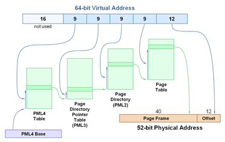

# Homework 1

## Q1

Imagine a that process P1 has a global variable "int x" that is initially 0. Suppose P1 forks to create P2. Then, P1 executes "x = 100", and P2 executes "x = 200". Before both processes terminate they print out the value of x.
Which of the following outcomes would occur?


- [ ] Both processes would print 0
- [ ] Both processes would print 100
- [ ] Both processes would print 200
- [x] P1 would print 100; P2 would print 200
- [ ] Both processes would print either 100 or 200, but both would print the same thing
- [ ] P1 could print 100 or 200, and P2 could also print either 100 or 200


## Q2

In class, we discussed that syscalls pass arguments to the kernel in registers. However, some things do not fit in registers. For example, a read() syscall may ask for many bytes of data. In this case, the process passes a pointer to the buffer that it would like the kernel to fill with data.

Which of the following things is true?

- [ ] It is safe for the kernel to fill the buffer with data regardless of what the value of the pointer is that the process passes to the kernel.
- [x] Passing any pointer that points to a buffer contained within the processes' heap or stack is okay since the kernel has access to all of the processes' state.
- [ ] The pointer to the buffer should not point to the processes' stack memory because the kernel is not allowed to access the process' stack.
- [ ] The pointer to the buffer should not point to the processes' heap memory because the kernel is not allowed to access the process' heap.


## Q3

Below is the source code for a small program I wrote (compiled and run on Linux on the CADE machines). The first part of the program forces the process and all of its descendent processes to run on one specific CPU core (core 0). The end of the program just computes some multiplication in a loop that takes awhile.

``` c
#define _GNU_SOURCE
#include <sched.h>
#include <stdlib.h>
#include <unistd.h>
#include <stdio.h>
#include <assert.h>

int
main(int argc, char *argv[])
{
   // This code forces this process and its children to run on one CPU core.
   cpu_set_t *cpusetp = CPU_ALLOC(1);
   size_t size = CPU_ALLOC_SIZE(1);
   CPU_ZERO_S(size, cpusetp);
   CPU_SET_S(0, size, cpusetp);
   sched_setaffinity(0, size, cpusetp);
   CPU_FREE(cpusetp);

   // fork();     // <--- What is approximate duration of the parent process's existence if this is uncommented?
   int j = 7812312;
   for (int i = 0; i < 1000000000; i++)
     j *= j;
   return j;
}
```

When I compile this ("gcc -O3 -std=c11 pin.c -o pin") and run it and time the process on CADE ("time ./pin") in runs in about 0.75 seconds. "time" here simply reports the duration from the time that the "pin" process was created until the time that it exited.

Just before the loop there is a commented-out call to fork(). If I uncomment that, recompile, and rerun the code, about how long will the "time" command report that the parent took. (Keep in mind here: this is only reporting the time it takes for the parent process to exit, since the parent here isn't directly waiting on the child process that fork would create.) 

- [ ] About 0.38 seconds
- [ ] About 0.75 seconds
- [x] About 1.5 seconds
- [ ] 0 seconds; it will crash


## Q4

For Question 3, what if fork() was called twice in a row before the loop instead of just once? About how long will it take for the initial process that is created when I run "time ./pin" to complete its work and exit?

- [ ] About 0.19 seconds
- [ ] About 0.75 seconds
- [ ] About 1.5 seconds
- [x] About 3.0 seconds
- [ ] 0 seconds; it will crash


## Q5

Compute the average response time and average turnaround time when running three jobs of length 300 with the SJF scheduler all with arrival times of 0.
Round all answers to the nearest integer time unit.

Average Response Time: 300

Average Turnaround Time: 600


## Q6

Now do the same (as Question 5) but with jobs of different lengths: 200, 500, and 300 (with arrival times of 0).
Round all answers to the nearest integer time unit.

Average Response Time: 233

Average Turnaround Time: 567


## Q7

Now repeat the workload for Question 6, but use RR with a timeslice of 100 (assume the processes arrive in the order listed but with arrival time very close to 0).
Round all answers to the nearest integer time unit.

Average Response Time: 100

Average Turnaround Time: 733


## Q8

Below is a diagram for the paging structures for 64-bit mode in Intel x86-64 processors. Keep in mind that on this architecture pointers are 8 bytes, pages are 4 KB, and page table entries are 8 bytes. Address translation works like this:



Consider one page directory entry in the Page Directory (PML2). How many bytes of the virtual address space can be accessed using this single entry?

- [ ] 2^12
- [ ] 2^11
- [ ] 2^22
- [x] 2^21


## Q9

Referring to the scenario and diagram from Question 8.

Suppose that the page size is changed from 4 KB to 2 MB (221 bytes). That is, the system is redesigned to support 2 MB pages per page table entry only. How many bits of the virtual address should this new scheme use to index into the Page Table (PML1) level of the paging structures as it performs a walk of them? Assume that the new design keeps the same "unused" 16 bits in each virtual address.

- [ ] 9
- [ ] 10
- [ ] 17
- [x] 18
- [ ] 21


## Q10

Given the following reference string to a set of pages (named A, B, C, D, E, and F):

Reference String: C A C B D F D A F C D E

Imagine we have a machine that has three physical page frame to hold pages (from disk) in. If the system used the Clock algorithm we described in class, and it started with physical memory empty and the "clock hand" pointing at the first physical page frame, how many total misses/disk accesses would have occurred at the end of this access sequence?

Assume each page is immediately marked "accessed" or "used" after it is placed in physical memory.

9
